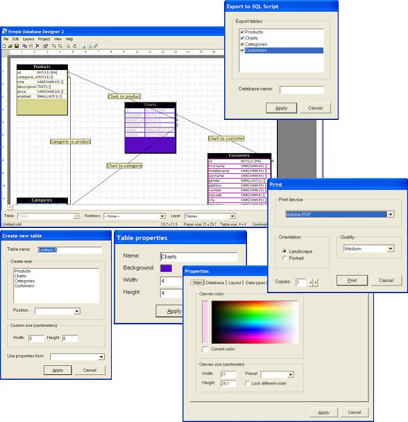



## Simple Database Designer 2

### Description

Simple Database Designer is an application witch can be used to create your one database models. You can add tables, columns, relations and layers. You can save and open projects, export your project to a Bitmap drawing and export your project to a SQL script. Since version 2 you can also print your project and display a print preview. Also a big change is the grid function. With the grid function you can display a grid inside the work area and you can use the 'Snap to grid' option to move the tables perfectly near the other tables. Also the relations are changes since version 1. Now you can specify in what kind of direction the relation goes.

Please vote for me.
 
### More Info
 
This code used the following components:

- Microsoft Common Dialog Control 6.0 (comdlg32.ocx)

- Microsoft Tabbed Dialog Control 6.0 (tabctl32.ocx)

- Microsoft Windows Common Controls 6.0 (mscomctl.ocx)

All of these components are probably already installed onto your computer.

This is still a beta version so there could be some big bugs inside of it. If you find any kind of bugs please post them here.

             |
---                |---
**Submitted On**   |2006-04-20 13:43:24
**By**             |[Jasper van Gent](https://github.com/Planet-Source-Code/PSCIndex/blob/master/ByAuthor/jasper-van-gent.md)
**Level**          |Intermediate
**User Rating**    |4.9 (49 globes from 10 users)
**Compatibility**  |VB 5\.0, VB 6\.0
**Category**       |[Complete Applications](https://github.com/Planet-Source-Code/PSCIndex/blob/master/ByCategory/complete-applications__1-27.md)
**World**          |[Visual Basic](https://github.com/Planet-Source-Code/PSCIndex/blob/master/ByWorld/visual-basic.md)
**Archive File**   |[Simple\_Dat1988774212006\.zip](https://github.com/Planet-Source-Code/jasper-van-gent-simple-database-designer-2__1-65071/archive/master.zip)

